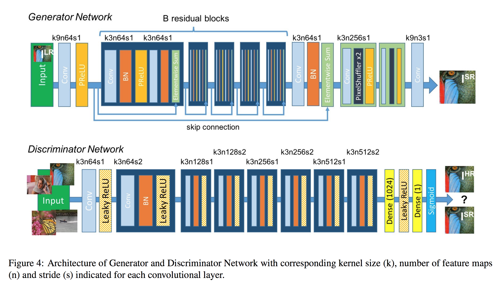
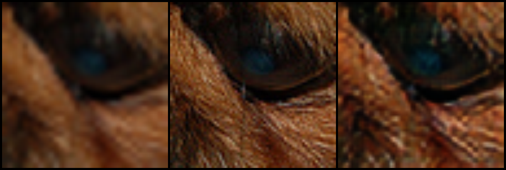
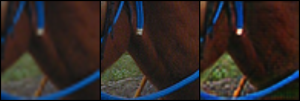
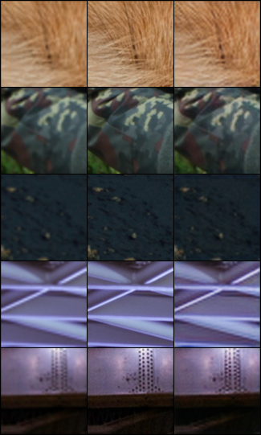
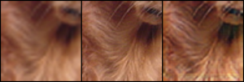
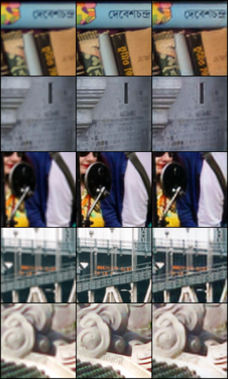
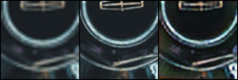
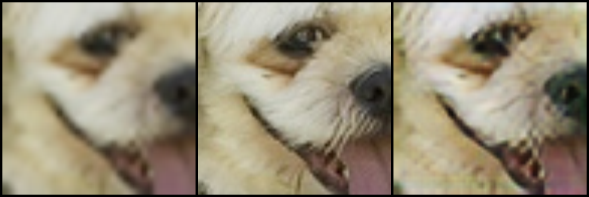

# Photo-Realistic Single Image Super-Resolution using Generative Adversarial Network (SRGAN)

Photo-Realistic single image super-resolution using Generative Adversarial Network (SRGAN) implemented using PyTorch. Source paper: [Photo-Realistic Single Image Super-Resolution Using a Generative Adversarial Network](https://arxiv.org/pdf/1609.04802.pdf)

## SRGAN Architecture

## Dataset

[DIVerse 2K - DIV2K](https://data.vision.ee.ethz.ch/cvl/DIV2K/) resolution high quality images dataset and [VOC2012](https://www.kaggle.com/huanghanchina/pascal-voc-2012) dataset were both randomly sampled and was used as training and validation set for this project. Download the Train Data (HR images) and Validation Data (HR Images) zip files and extract them under **data** folder.

## Results obtained

Left image is Low Resolution Image, Middle image is original High Resolution Image, and the right image is the Generated Super-Resolution Image.

### Sample 1

### Sample 2

### Sample 3

## Usage

Use bash terminal or Powershell or Command Prompt

### For training

Change the training configuration (Epochs, Batch Size, Crop Size, Upscale Factor) in the script.

`python train.py`

### For testing

Change the testing configuration (Upscale Factor & Trained Model path) in the script.

`python test.py`

## Pretrained model

Pretrained model is available under the [trained_models](trained_models/) folder.

* [generator_2_100.pth](generator_2_100.pth) - Generator model for upscale factor 2 & crop size 88 (trained for 100 epochs)
* [generator_4_100.pth](generator_4_100.pth) - Generator model for upscale factor 4 & crop size 96 (trained for 100 epochs)

## Module Description

* [models.py](models.py) - Contains the implementation of Residual Block, UpSample Block, Generator, and Discriminator.
* [losses.py](losses.py) - Contains the implementation of generator loss function (Image loss, Perpetual loss, Total Variation loss, and Adversarial loss. Have used WGAN).
* [utils.py](utils.py) - Contains Transformation fucntions and custom Dataset classes for training and validation sets.
* [pyssim.py](pyssim.py) - Contains functions to calculate Structural similarity scores and Peak Signal to Noise ratio of given images.
* [train.py](train.py) - Training script to train the SRGAN model.
* [test.py](test.py) - A simple test script to convert low resolution image to super resolution using the trained model.

## Requirements

Python 3 is required. I trained the model for 100 epochs on NVIDIA GTX 1050 Ti 4GB GPU and 8 GB RAM which took almost 6 hours to get completed.

### My System Configuration

* Windows 10 Home 64-bit OS
* NVIDIA GTX 1050 Ti 4GB GPU
* 8 GB DDR4 RAM
* Python 3.7.4 64-bit
* CUDA 10.1
* CUDNN 7.6

### Required libraries

All the required libraries have been included in the [requirements.txt](requirements.txt) file.

* PyTorch (torch)
* Torchvision (torchvision)
* Numpy (numpy)
* Matplotlib (matplotlib)
* Pillow (Pillow)
* Pandas (pandas)
* OpenCV (opencv-python)

### Install the Requirements

Install the required libraries using [pip](https://pip.pypa.io/en/stable/) package manager

`pip install -r requirements.txt`

## Future Scopes

* Try variants of SRGAN and do a comparison.
* Build a Web UI in which user can upload low resolution images and convert them to high resolution images

## License

MIT License

Copyright (c) 2020 Hao Ren

Permission is hereby granted, free of charge, to any person obtaining a copy
of this software and associated documentation files (the "Software"), to deal
in the Software without restriction, including without limitation the rights
to use, copy, modify, merge, publish, distribute, sublicense, and/or sell
copies of the Software, and to permit persons to whom the Software is
furnished to do so, subject to the following conditions:

The above copyright notice and this permission notice shall be included in all
copies or substantial portions of the Software.

THE SOFTWARE IS PROVIDED "AS IS", WITHOUT WARRANTY OF ANY KIND, EXPRESS OR
IMPLIED, INCLUDING BUT NOT LIMITED TO THE WARRANTIES OF MERCHANTABILITY,
FITNESS FOR A PARTICULAR PURPOSE AND NONINFRINGEMENT. IN NO EVENT SHALL THE
AUTHORS OR COPYRIGHT HOLDERS BE LIABLE FOR ANY CLAIM, DAMAGES OR OTHER
LIABILITY, WHETHER IN AN ACTION OF CONTRACT, TORT OR OTHERWISE, ARISING FROM,
OUT OF OR IN CONNECTION WITH THE SOFTWARE OR THE USE OR OTHER DEALINGS IN THE
SOFTWARE.

## Reference Papers

* [SRGAN - Photo-Realistic Single Image Super-Resolution Using a Generative Adversarial Network](https://arxiv.org/pdf/1609.04802.pdf)
* [WGAN - Wassertein GAN](https://arxiv.org/pdf/1701.07875.pdf)
* [NTIRE 2017 Challenge on Single Image Super-Resolution: Dataset and Study](https://people.ee.ethz.ch/~timofter/publications/Agustsson-CVPRW-2017.pdf)
